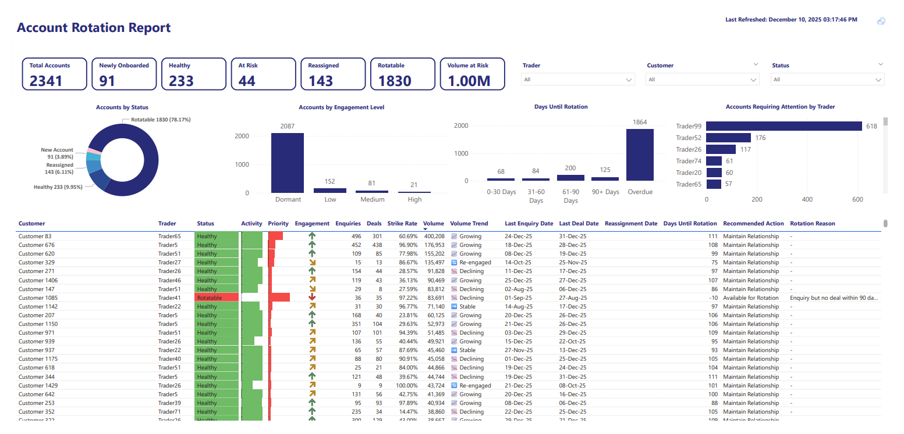

# Account Rotation (3+3 Model) – Customer Engagement Analysis

A Power BI solution that evaluates customer engagement across rolling 90-day windows to classify account health, trigger follow-up alerts, and prevent customer churn in B2B commodity trading.

---

## 📊 Dashboard Preview

<p align="center">
  
</p>
<p align="center"><i>Customer engagement dashboard showing account health distribution, rotation timelines, trader workload, and actionable alerts.</i></p>

---

## 🏢 Business Context

In commodity trading, customer relationships require consistent engagement. Unlike retail businesses with frequent transactions, B2B trading deals are sporadic — a customer might only place orders a few times per year. This creates a challenge: **how do you identify which accounts are healthy vs. at risk of churning when transaction frequency is naturally low?**

The 3+3 rotation model solves this by:

- Evaluating **enquiry activity** (engagement signals) separately from **deal activity** (conversion signals)
- Creating structured follow-up windows that match the natural sales cycle
- Giving traders early warning before accounts go cold
- Enabling managers to balance workload and monitor team performance

---

## 🎯 What This Dashboard Delivers

| Stakeholder | Value |
|-------------|-------|
| **Traders** | Prioritized list of accounts needing follow-up, with recommended actions and days until rotation |
| **Managers** | Team workload visibility, at-risk account distribution, rotation percentages by trader |
| **Leadership** | Portfolio health overview, volume at risk, engagement trends across the business |

---

## 🧠 The 3+3 Rotation Logic

Customers are evaluated across two sequential 90-day windows:

```
│◄────── Window 1: Enquiry ──────►│◄────── Window 2: Deal ──────►│
│         (Days 0–90)              │        (Days 91–180)          │
│                                  │                               │
│  Did customer send enquiries?    │   Did enquiry convert to deal?│
│                                  │                               │
│  Reference: Last Deal Date       │   Deadline: Enquiry + 90 days │
│  (or Date of Addition)           │   (or Reference + 90 days)    │
```

### Classification Rules

| Status | Condition |
|--------|-----------|
| **Healthy** | Days until deadline > 30 |
| **At Risk** | Days until deadline ≤ 30 (but not overdue) |
| **Rotatable** | Deadline has passed (0 or negative days remaining) |
| **Reassigned** | Recently reassigned to new trader (within 90-day grace period) |
| **New Account** | Added within last 90 days with no prior reassignment |

---

## 🗂 Data Model

```
┌─────────────────────┐
│   Customers Lookup  │ ◄─── Central dimension table
│─────────────────────│
│ Customer Key (PK)   │
│ Customer Name       │
│ Trader              │───────────────┐
│ Responsibility Ctr  │               │
│ Status              │               ▼
│ Date of Addition    │──┐    ┌─────────────────┐
│ Unified Status*     │  │    │  Trader Lookup  │
│ Engagement Level*   │  │    │─────────────────│
│ Rotation Urgency*   │  │    │ Dynamics User   │
└──────────┬──────────┘  │    │ Trader          │
           │             │    │ Role            │
    ┌──────┴──────┐      │    │ Manager         │
    │             │      │    │ Team            │
    ▼             ▼      │    │ Email           │
┌─────────┐  ┌─────────┐ │    └─────────────────┘
│ Deals   │  │Enquiries│ │
│─────────│  │─────────│ │    ┌─────────────────┐
│Deal No. │  │Deal No. │ │    │   Date Table    │
│Deal Date│  │Enq Date │ │    │─────────────────│
│Volume   │  │Status   │ └───►│ Date            │
│Customer │  │Customer │      │ YearMonth       │
│  Key    │  │  Key    │      │ Month Name      │
└─────────┘  └─────────┘      └─────────────────┘
                                      ▲
┌─────────────────────┐               │
│ Reassignment Table  │               │
│─────────────────────│               │
│ Customer Key        │───────────────┘
│ Reassignment Date   │
└─────────────────────┘

* Calculated columns
```

### Relationships

| From Table | From Column | To Table | To Column | Type |
|------------|-------------|----------|-----------|------|
| Deals | Customer Key | Customers Lookup | Customer Key | Many:1 |
| Enquiries | Customer Key | Customers Lookup | Customer Key | Many:1 |
| Reassignment Table | Customer Key | Customers Lookup | Customer Key | Many:1 |
| Customers Lookup | Trader | Trader Lookup | Dynamics User Name | Many:1 |
| Customers Lookup | Date of Addition | Date Table | Date | Many:1 |
| Deals | Deal Date | Date Table | Date | Many:1 (Inactive) |
| Enquiries | Enquiry Date | Date Table | Date | Many:1 (Inactive) |

---

## 🔧 Key DAX Measures & Calculated Columns

### Unified Status (Calculated Column)

The core classification logic that determines account health status:

```dax
Unified Status = 
VAR DateOfAddition = [Date of Addition]
VAR LastEnquiry = CALCULATE(MAX(Enquiries[Enquiry Date]))
VAR LastDeal = CALCULATE(MAX(Deals[Deal Date]))
VAR LastReassign = CALCULATE(MAX('Reassignment Table'[Reassignment Date]))

-- Grace period and new account checks
VAR InGracePeriod = NOT ISBLANK(LastReassign) && DATEDIFF(LastReassign, TODAY(), DAY) < 90
VAR IsNewAccount = DATEDIFF(DateOfAddition, TODAY(), DAY) < 90 && ISBLANK(LastReassign)

-- Reference date (priority: recent reassignment > last deal > assignment)
VAR ReferenceDate = 
    IF(
        InGracePeriod, LastReassign,
        IF(ISBLANK(LastDeal), DateOfAddition, LastDeal)
    )

-- Check for VALID enquiry (within 90 days of reference)
VAR HasValidEnquiry = 
    NOT ISBLANK(LastEnquiry) && 
    LastEnquiry > ReferenceDate && 
    DATEDIFF(ReferenceDate, LastEnquiry, DAY) <= 90

-- 90+90 LOGIC: Deadline is 90 days FROM ENQUIRY if valid enquiry exists
VAR Deadline = 
    IF(
        HasValidEnquiry,
        LastEnquiry + 90,    -- 90 days FROM ENQUIRY to close deal
        ReferenceDate + 90   -- 90 days from reference to get enquiry
    )

VAR DaysUntilDeadline = DATEDIFF(TODAY(), Deadline, DAY)

RETURN
SWITCH(
    TRUE(),
    InGracePeriod, "Reassigned",
    IsNewAccount, "New Account",
    DaysUntilDeadline <= 0, "Rotatable",
    DaysUntilDeadline <= 30, "At Risk",
    "Healthy"
)
```

### Days Until Rotation

```dax
Days Until Rotation = 
VAR DateOfAddition = CALCULATE(MAX('Customers Lookup'[Date of Addition]))
VAR LastEnquiry = CALCULATE(MAX(Enquiries[Enquiry Date]))
VAR LastDeal = CALCULATE(MAX(Deals[Deal Date]))
VAR LastReassign = CALCULATE(MAX('Reassignment Table'[Reassignment Date]))

VAR InGracePeriod = NOT ISBLANK(LastReassign) && DATEDIFF(LastReassign, TODAY(), DAY) < 90

VAR ReferenceDate = 
    IF(
        InGracePeriod, LastReassign,
        IF(ISBLANK(LastDeal), DateOfAddition, LastDeal)
    )

VAR HasValidEnquiry = 
    NOT ISBLANK(LastEnquiry) && 
    LastEnquiry > ReferenceDate && 
    DATEDIFF(ReferenceDate, LastEnquiry, DAY) <= 90

VAR Deadline = 
    IF(
        HasValidEnquiry,
        LastEnquiry + 90,
        ReferenceDate + 90
    )

RETURN DATEDIFF(TODAY(), Deadline, DAY)
```

### Engagement Level (Calculated Column)

Categorizes customer engagement intensity based on activity volume:

```dax
Engagement Level Column = 
VAR CurrentCustomerKey = 'Customers Lookup'[Customer Key]
VAR DateOfAddition = 'Customers Lookup'[Date of Addition]

VAR LastEnquiry = CALCULATE(MAX(Enquiries[Enquiry Date]), ALL(Enquiries), Enquiries[Customer Key] = CurrentCustomerKey)
VAR LastDeal = CALCULATE(MAX(Deals[Deal Date]), ALL(Deals), Deals[Customer Key] = CurrentCustomerKey)
VAR LastReassign = CALCULATE(MAX('Reassignment Table'[Reassignment Date]), ALL('Reassignment Table'), 'Reassignment Table'[Customer Key] = CurrentCustomerKey)

-- Rotation logic
VAR InGracePeriod = NOT ISBLANK(LastReassign) && DATEDIFF(LastReassign, TODAY(), DAY) < 90
VAR ReferenceDate = IF(InGracePeriod, LastReassign, IF(ISBLANK(LastDeal), DateOfAddition, LastDeal))
VAR HasValidEnquiry = NOT ISBLANK(LastEnquiry) && LastEnquiry > ReferenceDate && DATEDIFF(ReferenceDate, LastEnquiry, DAY) <= 90
VAR Deadline = IF(HasValidEnquiry, LastEnquiry + 90, ReferenceDate + 90)
VAR IsRotatable = DATEDIFF(TODAY(), Deadline, DAY) <= 0

-- Engagement calculation
VAR EnquiriesLast180 = CALCULATE(COUNTROWS(Enquiries), ALL(Enquiries), Enquiries[Customer Key] = CurrentCustomerKey, Enquiries[Enquiry Date] >= TODAY() - 180)
VAR DealsLast180 = CALCULATE(COUNTROWS(Enquiries), ALL(Enquiries), Enquiries[Customer Key] = CurrentCustomerKey, Enquiries[Status] = "Fixed", Enquiries[Enquiry Date] >= TODAY() - 180)

VAR BaseEngagement = 
    SWITCH(
        TRUE(), 
        DealsLast180 >= 6 || EnquiriesLast180 >= 12, "High", 
        DealsLast180 >= 2 || EnquiriesLast180 >= 6, "Medium", 
        EnquiriesLast180 > 0 || DealsLast180 > 0, "Low", 
        "Dormant"
    )

RETURN IF(IsRotatable, "Dormant", BaseEngagement)
```

### Rotation Urgency (Calculated Column)

```dax
Rotation Urgency Column = 
VAR CurrentCustomerKey = 'Customers Lookup'[Customer Key]
VAR DateOfAddition = 'Customers Lookup'[Date of Addition]

VAR LastEnquiry = CALCULATE(MAX(Enquiries[Enquiry Date]), ALL(Enquiries), Enquiries[Customer Key] = CurrentCustomerKey)
VAR LastDeal = CALCULATE(MAX(Deals[Deal Date]), ALL(Deals), Deals[Customer Key] = CurrentCustomerKey)
VAR LastReassign = CALCULATE(MAX('Reassignment Table'[Reassignment Date]), ALL('Reassignment Table'), 'Reassignment Table'[Customer Key] = CurrentCustomerKey)

VAR InGracePeriod = NOT ISBLANK(LastReassign) && DATEDIFF(LastReassign, TODAY(), DAY) < 90
VAR ReferenceDate = IF(InGracePeriod, LastReassign, IF(ISBLANK(LastDeal), DateOfAddition, LastDeal))
VAR HasValidEnquiry = NOT ISBLANK(LastEnquiry) && LastEnquiry > ReferenceDate && DATEDIFF(ReferenceDate, LastEnquiry, DAY) <= 90
VAR Deadline = IF(HasValidEnquiry, LastEnquiry + 90, ReferenceDate + 90)
VAR DaysLeft = DATEDIFF(TODAY(), Deadline, DAY)

RETURN
SWITCH(
    TRUE(),
    DaysLeft < 0, "Overdue",
    DaysLeft <= 30, "0-30 Days",
    DaysLeft <= 60, "31-60 Days",
    DaysLeft <= 90, "61-90 Days",
    "90+ Days"
)
```

### Activity Score

Weighted scoring combining enquiry and deal recency (80% deals, 20% enquiries):

```dax
Activity Score = 
VAR DaysSinceEnquiry = [Days Since Last Enquiry]
VAR DaysSinceDeal = [Days Since Last Deal]
VAR HasEnquiry = NOT ISBLANK([Last Enquiry Date])
VAR HasDeal = NOT ISBLANK([Last Deal Date])

-- 80/20 split: Deals 80%, Enquiries 20% - Pure recency, no volume
VAR EnquiryRecencyScore = IF(HasEnquiry, MAX(0, 20 - (DaysSinceEnquiry * 0.2)), 0)
VAR DealRecencyScore = IF(HasDeal, MAX(0, 80 - (DaysSinceDeal * 0.8)), 0)

VAR TotalScore = EnquiryRecencyScore + DealRecencyScore

RETURN MIN(TotalScore, 100)
```

### Priority Score

Intelligent prioritization combining status, history, volume, and strike rate:

```dax
Priority Score = 
VAR CurrentStatus = SELECTEDVALUE('Customers Lookup'[Unified Status])
VAR TotalVolume = [Volume Fixed]
VAR TotalDeals = [Total Deals]
VAR StrikeRate = [Strike Rate]
VAR HasHistory = TotalDeals > 0

-- Base priority by status (LOWER for rotatable with no history)
VAR BasePriority = 
    SWITCH(
        CurrentStatus,
        "Rotatable", IF(HasHistory, 100, 30),  -- 100 if previous customer, 30 if never engaged
        "At Risk", IF(HasHistory, 70, 40),
        "Healthy", 20,
        "New Account", 10,
        "Grace Period", 5,
        0
    )

-- Volume multiplier (bigger past customers = higher priority)
VAR VolumeMultiplier = 1 + (TotalVolume / 50000)

-- Strike rate bonus (good converters deserve attention)
VAR StrikeBonus = IF(HasHistory && StrikeRate > 0.5, 1.3, 1)

RETURN BasePriority * VolumeMultiplier * StrikeBonus
```

### Rotation Reason

Explains why an account became rotatable:

```dax
Rotation Reason = 
VAR DateOfAddition = CALCULATE(MAX('Customers Lookup'[Date of Addition]))
VAR LastEnquiry = CALCULATE(MAX(Enquiries[Enquiry Date]))
VAR LastDeal = CALCULATE(MAX(Deals[Deal Date]))
VAR LastReassign = CALCULATE(MAX('Reassignment Table'[Reassignment Date]))
VAR CurrentStatus = SELECTEDVALUE('Customers Lookup'[Unified Status])

VAR InGracePeriod = NOT ISBLANK(LastReassign) && DATEDIFF(LastReassign, TODAY(), DAY) < 90
VAR ReferenceDate = IF(InGracePeriod, LastReassign, IF(ISBLANK(LastDeal), DateOfAddition, LastDeal))
VAR HasValidEnquiry = 
    NOT ISBLANK(LastEnquiry) && 
    LastEnquiry > ReferenceDate && 
    DATEDIFF(ReferenceDate, LastEnquiry, DAY) <= 90

VAR NoEnquiry90 = NOT HasValidEnquiry
VAR EnquiryNoFix90 = HasValidEnquiry && DATEDIFF(LastEnquiry, TODAY(), DAY) > 90

RETURN
IF(
    CurrentStatus = "Rotatable",
    SWITCH(
        TRUE(),
        NoEnquiry90, "No enquiry within 90 days",
        EnquiryNoFix90, "Enquiry but no deal within 90 days",
        "-"
    ),
    "-"
)
```

### Volume Trend

Visual indicator of account trajectory:

```dax
Volume Trend = 
VAR TotalDeals = [Total Deals]
VAR CurrentVolume = [Volume Last 90 Days]
VAR PreviousVolume = [Volume Previous 90 Days]
VAR DaysSinceAddition = [Days Since Addition]
VAR RecentDeals = 
    CALCULATE(
        COUNTROWS(Deals),
        Deals[Deal Date] >= TODAY() - 90
    )

RETURN
SWITCH(
    TRUE(),
    TotalDeals <= 3 && DaysSinceAddition <= 90, "🆕 New",
    RecentDeals > 0 && ISBLANK(PreviousVolume), "🔄 Re-engaged",
    ISBLANK(PreviousVolume) && ISBLANK(CurrentVolume), "💤 Inactive",
    CurrentVolume > PreviousVolume * 1.1, "📈 Growing",
    CurrentVolume < PreviousVolume * 0.9, "📉 Declining",
    "➡️ Stable"
)
```

### Recommended Action

```dax
Recommended Action = 
VAR CurrentStatus = SELECTEDVALUE('Customers Lookup'[Unified Status])

RETURN
SWITCH(
    CurrentStatus,
    "Reassigned", "Monitor",
    "New Account", "New Customer",
    "Rotatable", "Available for Rotation",
    "At Risk", "Follow Up",
    "Healthy", "Maintain Relationship",
    "-"
)
```

---

## 📊 Summary Measures

| Measure | Purpose |
|---------|---------|
| `Total Accounts` | DISTINCTCOUNT of all customers |
| `Healthy Accounts` | Count where Unified Status = "Healthy" |
| `At Risk Accounts` | Count where Unified Status = "At Risk" |
| `Rotatable Accounts` | Count where Unified Status = "Rotatable" |
| `New Accounts` | Count where Unified Status = "New Account" |
| `Reassigned Accounts` | Count where Unified Status = "Reassigned" |
| `Strike Rate` | DIVIDE([Total Deals], [Total Enquiries]) |
| `Volume Fixed` | SUM of deal volumes |
| `Volume at Risk` | Volume from rotatable accounts |
| `Trader Rotation %` | Rotatable ÷ Total for each trader |
| `High Priority Rotatable` | Rotatable accounts with Priority Score > 100 |
| `Accounts Silent 60+ Days` | Accounts with no activity for 60+ days |
| `Accounts Silent 90+ Days` | Accounts with no activity for 90+ days |

---

## 🛠 Technical Stack

| Component | Technology |
|-----------|------------|
| Visualization | Power BI Desktop |
| Data Modeling | Star schema with calculated columns |
| Calculations | DAX (time intelligence, SWITCH logic, iterators) |
| Data Transformation | Power Query (M) |
| Data Sources | Power Platform Dataflows, SharePoint Excel files |
| Date Intelligence | Custom Date Table with inactive relationships |

---

## 💡 Design Decisions

**1. Why 3+3 instead of 6-month rolling?**  
Separating enquiry and deal windows allows distinguishing between "engaged but not converting" (sales issue) vs. "not engaging at all" (relationship issue) — each requires different intervention.

**2. Why calculated columns for status instead of measures?**  
Status classification needs to work in row-level filters and slicers. Calculated columns evaluate at row context and persist, enabling filtering and conditional formatting without performance overhead.

**3. Why Priority Score uses volume multiplier?**  
A rotatable account that previously traded 50,000 MT deserves more attention than one that never converted. The score ensures high-value relationships get prioritized.

**4. Why inactive date relationships?**  
Multiple fact tables (Deals, Enquiries) connecting to the same Date Table require inactive relationships. Measures use USERELATIONSHIP() to activate the appropriate path when needed.

**5. Why 80/20 weighting in Activity Score?**  
Deals are the ultimate goal — a customer who enquires but never converts is less valuable than one who closes deals. The weighting reflects business priorities.

---

## 📁 Repository Contents

```
account-rotation-3plus3/
├── Account-Rotation-3plus3.pbix    # Full Power BI report
├── Account-Rotation-Screenshot.png  # Dashboard preview
├── README.md
└── datasets/
    ├── Customers_Anonymized.csv
    ├── Deals_Anonymized.csv
    ├── Enquiries_Anonymized.csv
    └── TraderLookup.csv
```

---

## ⚠️ Disclaimer

This project is for **portfolio demonstration only**. All customer names, trader identities, volumes, dates, and business identifiers have been replaced with synthetic anonymized values. No proprietary business logic, internal systems, or confidential information is included.

---

## 📬 Contact

**Muhammad Zia Ul Haq**  
📧 [zulhaq@gmail.com](mailto:zulhaq@gmail.com)  
🔗 [LinkedIn](https://www.linkedin.com/in/mziamalik)
