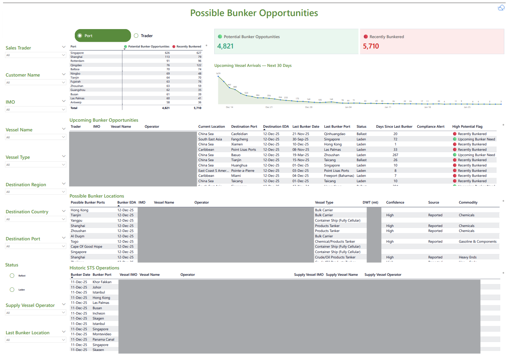

## 📊 Dashboard Preview

  

<i>Dashboard preview with sensitive vessel and operator details blurred for confidentiality.</i>

---

# Bunker Opportunities Overview – Vessel Activity & Potential Demand Analysis

This dashboard identifies **potential bunker opportunities** by analyzing vessel activity, estimated arrival dates, last bunker history, and historical STS operations.  
All vessel names, IMOs, operators, and sensitive fields in this preview have been **blurred or anonymized**.

---

## 🎯 Purpose of the Model

The analytics model helps commercial and trading teams:

- Detect **vessels likely to require bunkers soon**
- Identify **recently bunkered vessels**
- Forecast **upcoming vessel arrivals**
- Prioritize high-potential commercial leads
- Analyze **historical STS operations**
- Generate **proactive alerts for traders**
- Provide a focused, high-quality **opportunity pipeline**

The goal is to improve proactive outreach and increase bunker conversion rates.

---

## 📈 Key Metrics

- **Potential Bunker Opportunities**
- **Recently Bunkered Vessels**
- **Upcoming Arrivals – Next XX Days**
- **Days Since Last Bunker**
- **High Potential Flags**
- **Confidence Level / Source**
- **Commodity & Grade Summary**

---

# 🧠 Opportunity Identification Logic (Simplified Overview)

The model determines bunker demand likelihood using several factors:

### **1️⃣ Last Bunker Date Logic**
- Evaluates typical bunker cycles  
- Adjusts based on vessel class and DWT  
- Flags vessels approaching expected bunker intervals  

### **2️⃣ Destination-Based Prediction**
- High-bunkering ports (e.g., Singapore, Fujairah, Rotterdam) increase probability  
- Non-bunker ports decrease probability  

### **3️⃣ Vessel Type Consumption Profile**
Fuel consumption varies widely:
- High burn → Tanker, Container, VLCC  
- Low burn → Bulk Carrier, LPG  

### **4️⃣ STS Operation History**
Recent STS events can indicate:
- Recent bunker uplift  
- Preparation for onward long-haul movement  

### **5️⃣ Recently Bunkered Filter**
Realistically excludes vessels that bunkered recently.

---

# ⭐ High Potential Engine – How It Works

The **High Potential Engine** is a custom scoring model that ranks vessels by their likelihood to require bunkers soon.

### **What the Engine Evaluates**

#### **1️⃣ Days Since Last Bunker**
- Compares time passed with expected bunker cycle per vessel type  

#### **2️⃣ Destination Port Analysis**
- High-demand ports increase scoring  
- Long voyages without bunker events increase scoring further  

#### **3️⃣ ETA Forecast**
- Vessels arriving in the next **X–XX days** receive priority  

#### **4️⃣ Consumption Model by Vessel Type**
- Faster consumption → faster increase in potential  

#### **5️⃣ Compliance & Alert Flags**
- Operational anomalies affect scoring  

#### **6️⃣ STS Event Detection**
- Recent STS → adjust scoring depending on context  

#### **7️⃣ Recently Bunkered Filter**
- Overrides everything → marks “Not a Lead”

---

### **🏁 Engine Output Categories**

- **High Potential — Upcoming Bunker Need**
- **Medium Potential — Monitor**
- **Recently Bunkered — Excluded**
- **Not a Lead — Low Priority**

---

# 🚨 Vessel Alerts – Upcoming Bunkering Signals

The dashboard includes an alerting mechanism that automatically flags vessels requiring attention.

Alerts are triggered when:

- A vessel is **approaching its typical bunker interval**
- ETA to a major bunker port is within **X–XX days**
- The vessel has **no recent bunker history**
- Recent **STS activity** suggests increased consumption
- A vessel’s fuel pattern deviates from expected cycles
- A vessel shows **high distance traveled since last bunker**

Output alert levels:

- **🔴 High Priority** – Contact customer immediately  
- **🟠 Medium Priority** – Monitor and prepare follow-up  
- **🟡 Low Priority** – Optional follow-up  

These alerts help traders proactively engage customers **before** enquiries arrive.

---

# 🔒 Row-Level Security (RLS)

RLS ensures that each trader only sees vessels relevant to their portfolio.

### **RLS Rules Implemented**

- **Traders** see:
  - Vessels linked to their customer list  
  - Vessels flagged as “Unassigned”  
  - Vessel opportunities only in their managed ports  

- **Managers** see:
  - All vessels under their team’s customers  
  - All team opportunity alerts  

- **Leadership** sees:
  - All vessels and all opportunity pipelines  

### **Technical Implementation**
- Trader dimension table with unique user mapping  
- Customer–vessel relationship mapping  
- DAX-based security filters  
- Port-level filtering for geography-specific teams  

This ensures data confidentiality and aligns the report with real-world operational access.

---

# 🗂 Dashboard Components

### **1️⃣ Port-Level Opportunity Summary**
Summarizes:
- Total opportunities  
- Recently bunkered vessels  
- Opportunity distribution by port or region  

---

### **2️⃣ Upcoming Bunker Opportunities**
Includes:
- Vessel characteristics  
- ETA and destination  
- Last bunker date and port  
- High potential scoring  
- Alert level (High, Medium, Low)  

---

### **3️⃣ Possible Bunker Locations**
Predicts suitable bunkering ports based on sector patterns.

---

### **4️⃣ Historic STS Operations**
Displays synthetic, anonymized STS activity:
- Dates  
- Cargo types  
- Vessel classes  

---

# 🛠 Tools & Technologies

- **Power BI Desktop**
- **Power Query (M)** – data transformation  
- **DAX** – scoring model, alerts, ETA logic  
- **Synthetic & blurred datasets**  
- **Row-Level Security (RLS)**  
- **Maritime consumption logic**  

---

# ✔ Notes

- All vessel names, IMOs, operators, and dates are **blurred** for confidentiality.  
- Operational datasets are not included due to sensitivity and size.  
- This dashboard demonstrates maritime analytics, forecasting, and opportunity scoring.  
