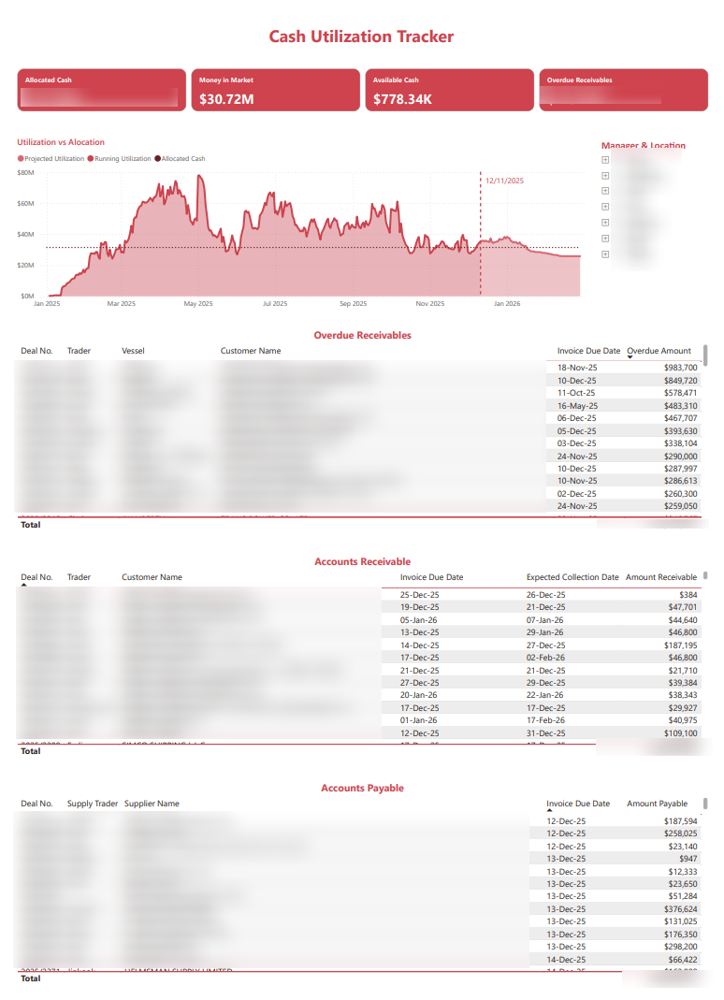

# 📊 Cash Utilization Tracker — Allocation, Forecasting & Liquidity Insights

<p align="center">
  
</p>
<p align="center"><i>Dashboard preview with anonymized values and blurred sensitive deal information.</i></p>

---

## 🎯 Purpose of the Model  

This dashboard helps trading, treasury, and finance teams understand:

- **Allocated cash**  
- **Running utilization vs expected utilization**  
- **Liquidity available in market**  
- **Overdue receivables & payables**  
- **Cash availability over time**  

The goal is to give management and traders full visibility into **cash exposure**, **funding requirements**, and **collection performance**.

---

## 📈 Key Metrics Monitored  

### **1️⃣ Allocated Cash**  
Total cash assigned to ongoing deals and supplier payments.

### **2️⃣ Running Utilization**  
Cumulative cash burned based on:

- Supplier payments  
- Customer receipts  
- Individual deal cash flows  

Displayed over time to reveal liquidity patterns.

### **3️⃣ Projected Utilization (90-Day Forecast)**  
A forward-looking model that calculates:

- Expected supplier payments  
- Expected customer collections  
- Upcoming cash exposure  
- Liquidity drop-off points  

Helps management anticipate funding needs.

---

## 🔍 Dashboard Sections  

### **📌 Utilization vs Allocation (Main Line Chart)**  
Shows:

- Actual historical cash usage  
- Projected utilization for the next 90 days  
- Allocation limits  
- Inflection points where cash exposure changes  

All values shown here are **synthetically transformed** to ensure confidentiality.

---

### **📌 Overdue Receivables**  
Highlights customers with invoices past due.  
Includes:

- Deal No.  
- Invoice date  
- Overdue amount  

All customer/vendor identifiers are blurred.

---

### **📌 Accounts Receivable (Upcoming Collections)**  
Shows expected cash inflows and estimated collection dates.

---

### **📌 Accounts Payable (Upcoming Outflows)**  
Displays supplier payments due in the coming period.

---

## 🧠 How the Model Works  

### **1️⃣ Running Utilization Logic**  

Based on:

- Running supplier payments (outflows)  
- Running customer receipts (inflows)  

```
Running Utilization = Running Paid – Running Receipts
```

Values are further anonymized using controlled transformations.

---

### **2️⃣ 90-Day Projection Model**  

Forecasts utilization based on:

- Outstanding supplier invoices  
- Customer receivables  
- Historical burn rate  

Projection is shown only for future dates.

---

## 🔒 Data Privacy & Anonymization  

This dashboard contains **no real financial data**.

✔ All amounts are transformed using mathematical noise functions  
✔ Identifying fields (customer, supplier, trader, vessel) are blurred  
✔ Chart patterns are altered while staying realistic  
✔ No operational data is exposed  
✔ Safe for public portfolio use  

---

## 🛠 Tools & Technologies  

- **Power BI Desktop**
- **DAX** for running totals and forecasting logic  
- **Power Query (M)** for data cleaning and anonymization  
- **SharePoint / Excel** as data sources  
- **Custom date intelligence model**  

---

## 📁 Files Included  

- `cash-utilization-screenshot.png` — blurred/anonymized dashboard preview  
- *(PBIX not included for confidentiality)*  

---

## ✔ Notes  

This dashboard is a **representative demonstration** of the cash utilization model used in a trading & finance environment.  
Actual business data, deal values, vendors, customers, and cash positions have been replaced with synthetic equivalents.
